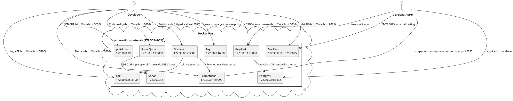

# DevOps Chapter — MyOperations Local Stack

## Why This Chapter Exists
The MyOperations DevOps stack gives developers a batteries-included playground that mirrors production-critical services (database, IAM, code quality, observability, mail, reverse proxy). Everything lives under `local-dev/` and is orchestrated with Docker Compose v2 using the fixed project name `myoperations-local-stack`. All services join the dedicated bridge network `myoperations-network` (`172.30.0.0/24`) with deterministic IPs so provisioning files can reference stable endpoints.

## High-Level Architecture
The diagram below is provided in PlantUML format so Kroki can render it server-side. It expresses the network flow between the developer workstation, the Docker host, and each containerized component.



### Component Inventory Snapshot
| Service       | Image Tag                         | Host Port(s)     | Auth Defaults         | Persistent Volume(s)                   |
|---------------|-----------------------------------|------------------|-----------------------|----------------------------------------|
| Postgres      | `pgvector/pgvector:pg17`          | 5432             | postgres / P@ssw0rd   | `postgres-data`                        |
| pgAdmin       | `dpage/pgadmin4:9.10.0`           | 5050             | admin@local.com/admin | `pgadmin-data`                         |
| Keycloak      | `quay.io/keycloak/keycloak:26.3.3`| 5080 -> 8080     | admin / admin         | shared Postgres schema `keycloak`      |
| Sonar DB      | `postgres:17`                     | internal only    | sonar / sonar         | `sonar-db-data`                        |
| SonarQube     | `sonarqube:25.10.0.114319-community` | 9000          | admin / admin*        | `sonar-data`, `sonar-extensions`       |
| Prometheus    | `prom/prometheus:v2.54.1`         | 9090             | n/a                   | `prometheus-data`                      |
| Loki          | `grafana/loki:2.9.8`              | 3100             | auth disabled         | `loki-data`                            |
| Grafana       | `grafana/grafana-oss:12.1.1`      | 3000             | admin / admin         | `grafana-storage`                      |
| MailHog       | `mailhog/mailhog:latest`          | 1025, 8025       | n/a                   | ephemeral                              |
| Nginx         | `nginx:1.26.2-alpine`             | 80               | n/a                   | static files `local-dev/nginx/html`    |

\* SonarQube forces a password change on first login.

## Cloning the Repository
```bash
git clone https://github.com/maravelias/myoperations-devops.git
cd myoperations-devops
```
- Requires Git plus Docker Engine 24+ / Docker Desktop 4.30+ with Compose v2 enabled.
- Use `git pull` inside the repo or `bash local-dev/scripts/update-stack.sh` to stay current.

## Install & Start the Stack
1. Ensure required host ports (80, 3000, 3100, 5050, 5080, 5432, 8025, 9000, 9090, 1025) are free.
2. From the repo root run:
   ```bash
   docker compose -f local-dev/docker-compose.yml up -d
   ```
3. Validate the configuration at any time:
   ```bash
   docker compose -f local-dev/docker-compose.yml config
   ```
4. View health:
   ```bash
   docker ps --format 'table {{.Names}}\t{{.Status}}'
   docker compose -f local-dev/docker-compose.yml logs -f
   ```
5. Stop (keeping data):
   ```bash
   docker compose -f local-dev/docker-compose.yml down
   ```
6. Full reset (removes named volumes — destructive):
   ```bash
   docker compose -f local-dev/docker-compose.yml down
   docker volume rm myoperations-local-stack_postgres-data \\
     myoperations-local-stack_sonar-db-data \\
     myoperations-local-stack_sonar-data \\
     myoperations-local-stack_sonar-extensions \\
     myoperations-local-stack_prometheus-data \\
     myoperations-local-stack_grafana-storage \\
     myoperations-local-stack_loki-data \\
     myoperations-local-stack_pgadmin-data
   docker compose -f local-dev/docker-compose.yml up -d
   ```

## Recommended Workflow
- **Day-to-day:** use `docker compose ... up -d`, iterate on application code pointing to the exposed endpoints, watch Grafana/Prometheus/Loki for feedback.
- **Configuration changes:** edit files under `local-dev/` (e.g., Prometheus scrape list, Keycloak realm, Grafana datasources), then restart affected services individually: `docker compose -f local-dev/docker-compose.yml up -d prometheus`.
- **VM deployment:** use `local-dev/scripts/deploy-to-vm.sh --with-systemd` (installs Docker and creates `myoperations-local-stack.service`) or run the Ansible playbook in `local-dev/ansible/site.yml` targeting `/opt/myoperations-devops`.
- **Automation chapter:** see the Automation page in this chapter for detailed instructions on `deploy-to-vm.sh`, `update-stack.sh`, and `cleanup.sh`. It explains how to provision, refresh, and retire the stack.

## Component Deep Dives
- [Postgres](component-postgres.md)
- [pgAdmin](component-pgadmin.md)
- [Keycloak](component-keycloak.md)
- [SonarQube](component-sonarqube.md) and [Sonar DB](component-sonar-db.md)
- [Prometheus](component-prometheus.md)
- [Loki](component-loki.md)
- [Grafana](component-grafana.md)
- [MailHog](component-mailhog.md)
- [Nginx](component-nginx.md)

Add new articles in this folder and reference them in `mkdocs.yml` under the **DevOps** section to surface them in the navigation.
