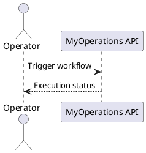

# MyOperations Documentation

Welcome to the MyOperations documentation portal powered by MkDocs. This site centralizes project overviews, operating procedures, and supporting diagrams (PlantUML/Kroki-compatible).

## Getting Started

1. Install Python 3.12+ and MkDocs (`pip install mkdocs`).
2. Clone the repository and change into it.
3. Use `mkdocs serve` for a live preview or `mkdocs build` to generate static assets.

## Extending the Docs

- Add or modify Markdown files under the `docs/` directory.
- Reference new pages in `mkdocs.yml` under the `nav` section.
- Embed diagrams using fenced blocks (e.g., `plantuml`, `mermaid`) which the Kroki plugin renders server-side.

## Diagram Support

MkDocs Material + Kroki render the above PlantUML snippet automatically during `mkdocs serve` or `mkdocs build`, removing the need for locally installed diagram tooling.

## Support

Please document architectural decisions, runbooks, and interface specifications in dedicated pages to keep the knowledge base current.
